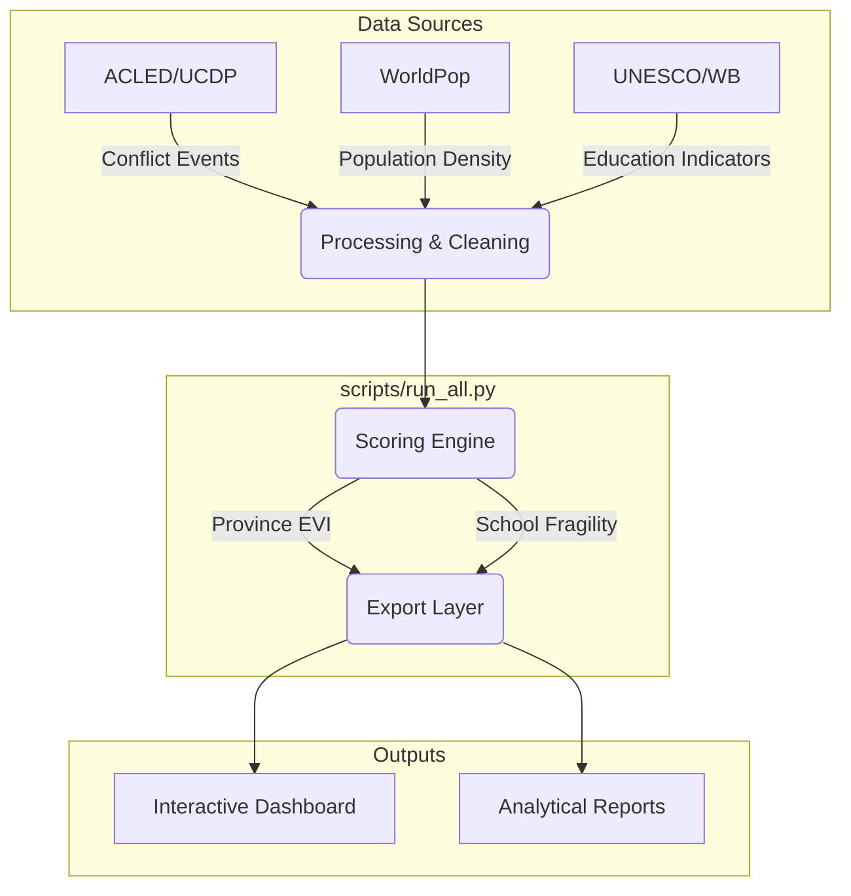

# Education Continuity: Risk Analysis Pipeline

This project provides a data-driven framework for the Education Bridge Initiative (EBI) to prioritize education programming in conflict-affected regions. It computes a multi-factor **Education Vulnerability Index (EVI)** using open-source data.

## 🌟 Key Features
- **Automated Data Ingestion**: Pulls conflict (ACLED/UCDP), education (UNESCO/WB), and population (WorldPop) data.
- **Vulnerability Scoring**: Multi-level scoring for provinces and individual schools.
- **Interactive Dashboard**: Visualizes risk trends and school fragility on a Mapbox-powered interface.
- **Extensible**: Supports any ISO3 country with minimal configuration.

## 📊 System Overview



## 🌍 Project Coverage
The pipeline currently supports pre-mapped configurations for the following contexts:

| Region | ISO3 | Status |
| :--- | :---: | :--- |
| **Sahel** | BFA, MLI, NER | ✅ Active |
| **East Africa** | SDN, SSD, SOM, ETH | ✅ Configured |
| **Middle East** | YEM, SYR, PSE, LBN | ✅ Configured |
| **Other** | AFG, UKR, MMR, COD, NGA | ✅ Configured |

## 📖 Documentation & Training

We have provided two versions of the documentation to support EBI staff:

1.  **[Quickstart Guide](./docs/QUICKSTART.md)**: A succinct "how-to" for running the pipeline and understanding the phases.
2.  **[Technical Manual](./docs/TECHNICAL_MANUAL.md)**: A descriptive reference covering formulas, data schemas, and extensibility.

*Other resources:*
- [Project Methodology](./docs/methodology.md)
- [Original RFP](./docs/RFP.md)

## 🚀 Getting Started

```bash
# Install dependencies
pip install -r requirements.txt

# Run the pipeline for Burkina Faso
python scripts/run_all.py --iso3 BFA
```

## 🛠 Tech Stack
- **Language**: Python 3.9+
- **Analysis**: Pandas, GeoPandas, NumPy, Rasterio
- **Visualization**: Mapbox GL JS, Chart.js, Vanilla CSS/HTML

---
*Built for the Education Bridge Initiative (EBI).*
